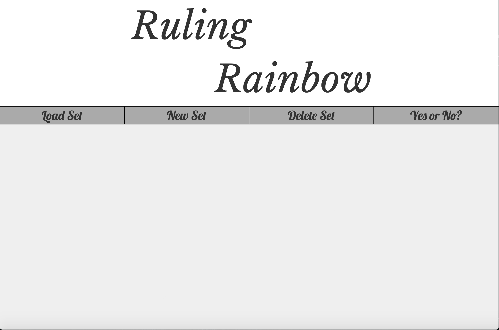

# Project Name
Ruling Rainbow
## Usage
From the dark skies of indecision comes the Ruling Rainbow.
Ruling Rainbow is used when you can't make up your mind about something. Input in all of the options you are stuck between, and one of them will be randomly returned. This process uses an API from random.org to get a truly random result.
Options can be set up so that they lose likelihood ("weight") to be chosen again after they have been chosen. Currently, option likelihood can degrade by 5%, 10%, 20%, or 25% with each selection, but they will never degrade completely. For no degradation you can select 0%, and for total elimination you can select 100%.
Option sets are automatically saved and can be loaded by using the "load" tab.
Options can be removed by clicking the X in the upper right corner. Whole sets may be deleted using the "delete" tab.

If you need to make a simple yes or no decision, select the "Yes or No" tab. Input your question and you will get back an entertaining Yes or No answer. This uses the yesno.wtf API.

## Images

